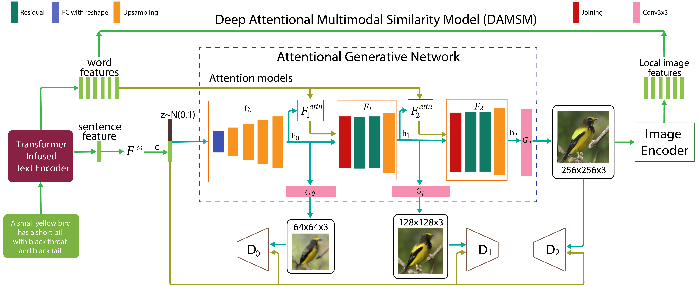

<h1> AttnGAN<sub>TRANS</sub> </h1>
<hr>

Implementation of Pytorch for recreating the key results of the TransGAN models in the paper <a href=""> Transformer Models for Enhancing AttnGAN based Text to Image Generation </a> by S Naveen, M S S Ram Kiran, M Indupriya, T V Manikanta and P V Sudeep.<br>



### Code Setup

- `bird` is implemented in google colab
- `coco` is implemented in local machine (NVIDIA Quadro RTX 8000). 

### Dependencies

python 3.6

Pytorch

In addition, please add the project folder to PYTHONPATH and `pip install` the following packages while running in local machine:
- `python-dateutil`
- `easydict`
- `pandas`
- `torchfile`
- `nltk`
- `scikit-image`    
    
If using Colab, all the dependencies will be available by default.

**Data**

- bird
    - Add <a href="https://drive.google.com/drive/folders/1AgN04EmAJTfxQJytlwodogE04-xWfQyi?usp=sharing">data</a> shortcut to your Google directory.
    - Rest of the file paths will be configured through the colab files.

- coco
    - Download [coco] :

**Training**
- Pre-train DAMSM models:
  - For bird dataset: 
  - For coco dataset: 
 
- Train AttnGAN models:
  - For bird dataset: run <a href=""> this </a> file in colab.
  - For coco dataset: run <a href=""> this </a> file in local machine.

- `*.yml` files are example configuration files for training/evaluation our models.
<!----
    Remove if this point not necessary.(Source: stackgan)
    If you want to try your own datasets, [here](https://github.com/soumith/ganhacks) are some good tips about how to train GAN. Also, we encourage to try different hyper-parameters and architectures, especially for more complex datasets. 
----!>


**Pretrained Model**

- bird
    - AttnGAN<sub>GPT</sub>
    - AttnGAN<sub>BERT</sub>
    - AttnGAN<sub>XL</sub>

- coco
    - AttnGAN<sub>GPT</sub>


**Sampling**


**Validation**
- To generate images for all captions in the validation dataset => save_img.ipynb
- We compute inception score for models trained on birds using [StackGAN-inception-model](https://github.com/hanzhanggit/StackGAN-inception-model).
- We compute inception score for models trained on coco using [improved-gan/inception_score](https://github.com/openai/improved-gan/tree/master/inception_score).


### Creating an API
[Evaluation code](eval) for `bird` is configured in this file to generate URL for the API. 

### Citing AttnGAN
If you find AttnGAN<sub>TRANS</sub> useful in your research, please consider citing:

```
@article{Tao18attngan,
  author    = {},
  title     = {},
  Year = {2021},
  booktitle = {}
}
```

**Reference**
- [AttnGAN: Fine-Grained Text to Image Generation with Attentional Generative Adversarial Networks](https://arxiv.org/abs/1711.10485) [[code]](https://github.com/taoxugit/AttnGAN#dependencies)
- [StackGAN++: Realistic Image Synthesis with Stacked Generative Adversarial Networks](https://arxiv.org/abs/1710.10916) [[code]](https://github.com/hanzhanggit/StackGAN-v2)

    
    
    
    
      
