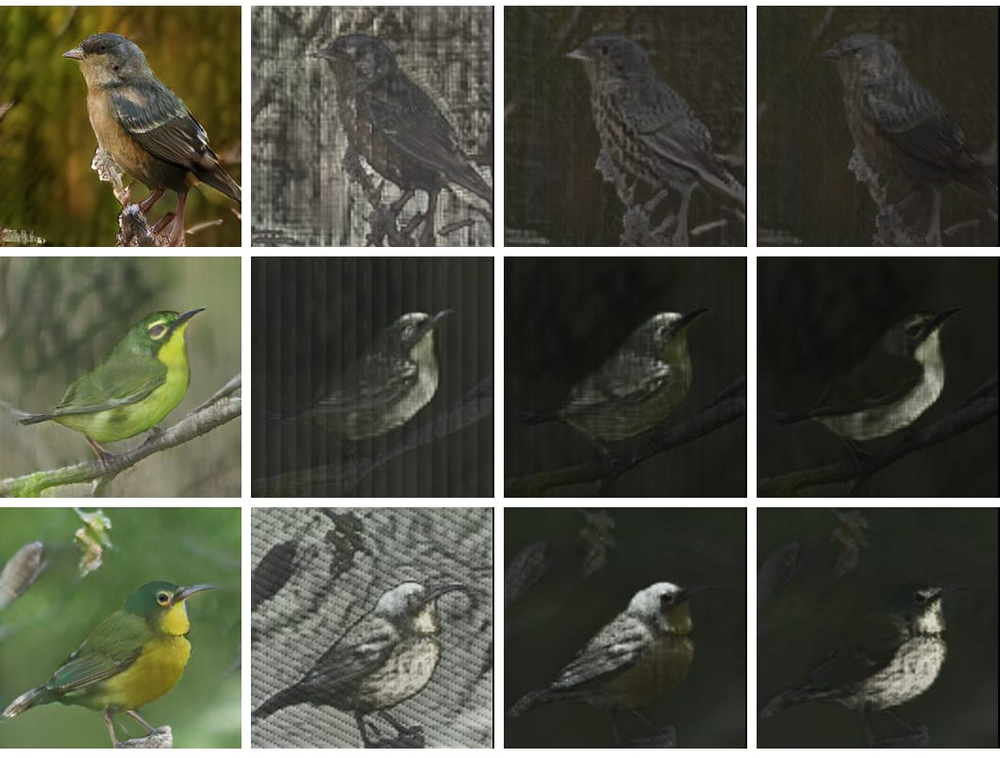
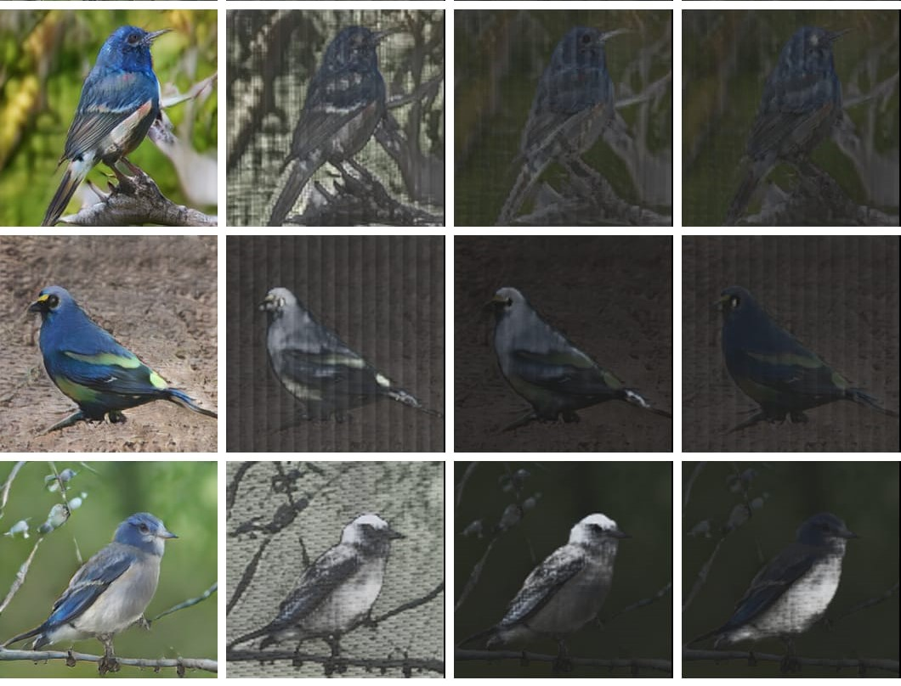

<h1> AttnGAN<sub>TRANS</sub> </h1>

Implementation of Pytorch for recreating the key results of the AttnGAN<sub>TRANS</SUB> models in the paper <a href=""> Transformer Models for Enhancing AttnGAN based Text to Image Generation </a> by S Naveen, M S S Ram Kiran, M Indupriya, T V Manikanta and P V Sudeep.<br>


### Code Setup

- `bird` is implemented in google colab
- `coco` is implemented in our local machine (NVIDIA Quadro RTX 8000). 


### Dependencies

- `python 3.6`

- `Pytorch`

In addition, please add the project folder to PYTHONPATH and `pip install` the following packages while running in local machine:
- `python-dateutil`
- `easydict`
- `pandas`
- `torchfile`
- `nltk`
- `scikit-image`    
    
If using Colab, all the dependencies will be available by default.


### Data

- Add our preprocessed metadata of [bird](https://drive.google.com/file/d/1-OtXxsW_hu8bg7jPbzt9hwbmE81DIKLU/view?usp=sharing) and [coco](https://drive.google.com/file/d/1HKVyKXvNm8J6bnGL93jIDzd5GmA5BTD6/view?usp=sharing) to your directory and save them to `data/`.
- Download the [birds](http://www.vision.caltech.edu/visipedia/CUB-200-2011.html) dataset and extract them to `data/birds/`.
- Download [coco](http://cocodataset.org/#download) dataset and extract the images to `data/coco/`.


### Training

- Pre-train encoder models: Use this [bird]() and [coco]() files to train the encoder models.
- Train models: Use this [bird]() and [coco]() files for training the models.
- `*.yml` files are example configuration files for training/evaluation our models.

  **Note:** While training `bird` files, we need to make modifications as suggestion in [configuration]() file. 
<!----
    Remove if this point not necessary.(Source: stackgan)
    If you want to try your own datasets, [here](https://github.com/soumith/ganhacks) are some good tips about how to train GAN. Also, we encourage to try different hyper-parameters and architectures, especially for more complex datasets. 
---->


### Pretrained Models
- **Encoder**
    - [AttnGAN<sub>GPT</sub>](https://drive.google.com/file/d/1-GBdK5LY9cBeSY9bVCbU3L0-GykZ3X0K/view?usp=sharing), [AttnGAN<sub>BERT</sub>](https://drive.google.com/file/d/1-PkIK2EsFR608FUsquPoUKpfUQ8UJrke/view?usp=sharing), [AttnGAN<sub>XL</sub>](https://drive.google.com/file/d/1k94zpjwBnqArXg_GRHaU_0k8m57vpDQk/view?usp=sharing)  for `bird`.    
    - [AttnGAN<sub>GPT</sub>](https://drive.google.com/file/d/1rE2wtxVTcvEB8VSXZar-jfVJ-BHMERq1/view?usp=sharing) for `coco`.

- **Pretrained Models**
    - [AttnGAN<sub>GPT</sub>](https://drive.google.com/file/d/196DOYwKhPoZIloXXVEKyUYnzHzeu7y9o/view?usp=sharing), [AttnGAN<sub>BERT</sub>](https://drive.google.com/file/d/1SycHf1fAsrrKLJNhU1AUZ2FShL6NMvhO/view?usp=sharing), [AttnGAN<sub>XL</sub>](https://drive.google.com/file/d/1dSIyBltDTOHxRzs-TVQOlJvqFXy-Utko/view?usp=sharing) for `bird`.
    - [AttnGAN<sub>GPT</sub>](https://drive.google.com/file/d/1fAWy7I8N2pccKWM0GeoMVobs3RrOL8db/view?usp=sharing) for `coco`.
 
 
### Sampling

For sampling we need to change configurations in cfg file.
- To generate images for the pre-extracted embeddings: Set `cfg.TRAIN.FLAG = False` and `cfg.B_VALIDATION = True`
- To generate images for custom text input: Set `cfg.TRAIN.FLAG = False` and `cfg.B_VALIDATION = False`

  **Note** If we are using [T2I training](). We need to add custom examples in example_caption.txt file. 


### Validation

- We compute inception score for models trained on birds using [StackGAN-inception-model](https://github.com/hanzhanggit/StackGAN-inception-model).
- We compute inception score for models trained on coco using [improved-gan/inception_score](https://github.com/openai/improved-gan/tree/master/inception_score).


### Sample Results
The below are the example results with generated image and attention maps of each AttnGAN<sub>TRANS</sub> models for the respective text captions.
- The first row in both the results are generated by AttnGAN<sub>BERT</sub> model.
- The fsecond row in both the results are generated by AttnGAN<sub>XL</sub> model.
- The third row in both the results are generated by AttnGAN<sub>GPT</sub> model.

This bird has wings that are green and has a yellow belly. | This bird has wings that are black and has large eyes with yellow and blue as the main colors and black as an accent.
:-------------------------:|:-------------------------:
  |  

### Creating an API
[Evaluation code](eval) for `bird` is configured in this file to generate URL for the API. 


### Citing AttnGAN
If you find AttnGAN<sub>TRANS</sub> useful in your research, please consider citing:

```
@article{Tao18attngan,
  author    = {},
  title     = {},
  Year = {2021},
  booktitle = {}
}
```

**Reference**
- [AttnGAN: Fine-Grained Text to Image Generation with Attentional Generative Adversarial Networks](https://arxiv.org/abs/1711.10485) [[code]](https://github.com/taoxugit/AttnGAN#dependencies)

    
      
